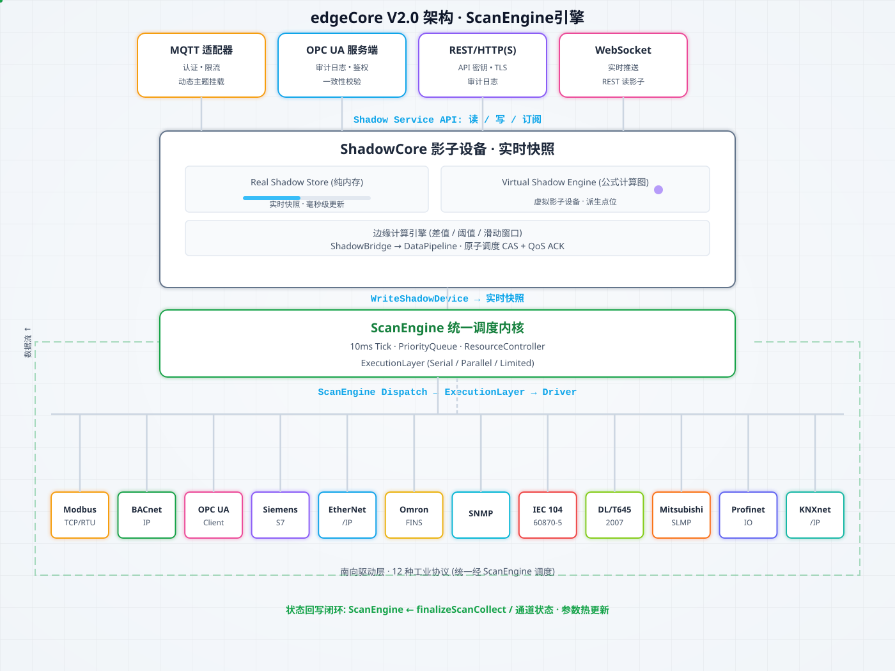

# Industrial Edge Gateway

[中文文档站点](https://anviod.github.io/edgeCore/) | [English](README.en.md) | [GPL-3.0](LICENSE)

edgeCore（工业边缘网关）是一款轻量级工业边缘计算网关软件，面向制造、能源、楼宇等现场，打通 **OT 设备 ↔ IT 系统** 数据通道：南向统一接入、边缘就地处理、北向灵活对接，一机完成采集到上报的闭环。支持 MCP 协议对接 LLM，内置工业级 SLA 保障长期可靠运行。

<div align="center">
  
  <p><small>数据流向总览</small></p>
</div>

## 核心能力

| 维度 | 能力 |
| --- | --- |
| **保障** | 工业级 SLA：内置指标门控 · Soak 长稳回归 · CI 五 gate，1 万 Tag 压测稳定无内存泄漏 |
| **南向** | 13 种工业协议，异构 OT 统一采集：设备发现 · 对象扫描 · 批量点位注册 |
| **采集** | 10ms 调度内核 · 内存影子真源，P99 调度 lag <150ms（≤10k tag） |
| **边缘** | 规则引擎 · 虚拟影子派生计算：跨设备映射 · 公式聚合 · 本地联动控制 |
| **北向** | 多协议对接云平台 / SCADA / 企业应用：MQTT · Sparkplug B · OPC UA · BACnet · EdgeOS |

轻量部署：单二进制 · 静态编译 · 无运行时依赖，最低 128MB 内存，支持 x86_64 / ARMv7 / ARM64。

## 快速开始

```bash
go mod tidy && go run cmd/main.go              # 后端，默认 -conf ./conf
cd ui && npm install && npm run build && cd .. # 前端（产物由后端托管 ui/dist）

# 一键多平台打包（GoReleaser，产物见 ./dist/）
goreleaser release --snapshot --clean
```

安装升级（deb / rpm）与 systemd 部署详见 [用户手册 — 安装指南](https://anviod.github.io/edgeCore/guide/USER_MANUAL.html#安装指南)。

## 文档

| 文档 | 说明 |
| --- | --- |
| [产品说明](https://anviod.github.io/edgeCore/guide/%E4%BA%A7%E5%93%81%E8%AF%B4%E6%98%8E.html) | 能力详解 · SLA 指标 · 更新记录 |
| [用户手册](https://anviod.github.io/edgeCore/guide/USER_MANUAL.html) | 协议 · 部署 · 操作 · 最佳实践 |
| [架构设计](https://anviod.github.io/edgeCore/architecture/index.html) | ScanEngine 调度内核 · ShadowCore · 系统架构 |
| [驱动矩阵](https://anviod.github.io/edgeCore/drivers/index.html) | 13 种协议驱动与开发规范 |
| [MCP 接入指南](https://anviod.github.io/edgeCore/guide/mcp-access-guide.html) | MCP 协议接入、工具清单与客户端配置 |
| [文档站点](https://anviod.github.io/edgeCore/) | 完整文档与开源计划 |

## 开源协议

本项目采用 [GNU General Public License v3.0](LICENSE) 开源协议。